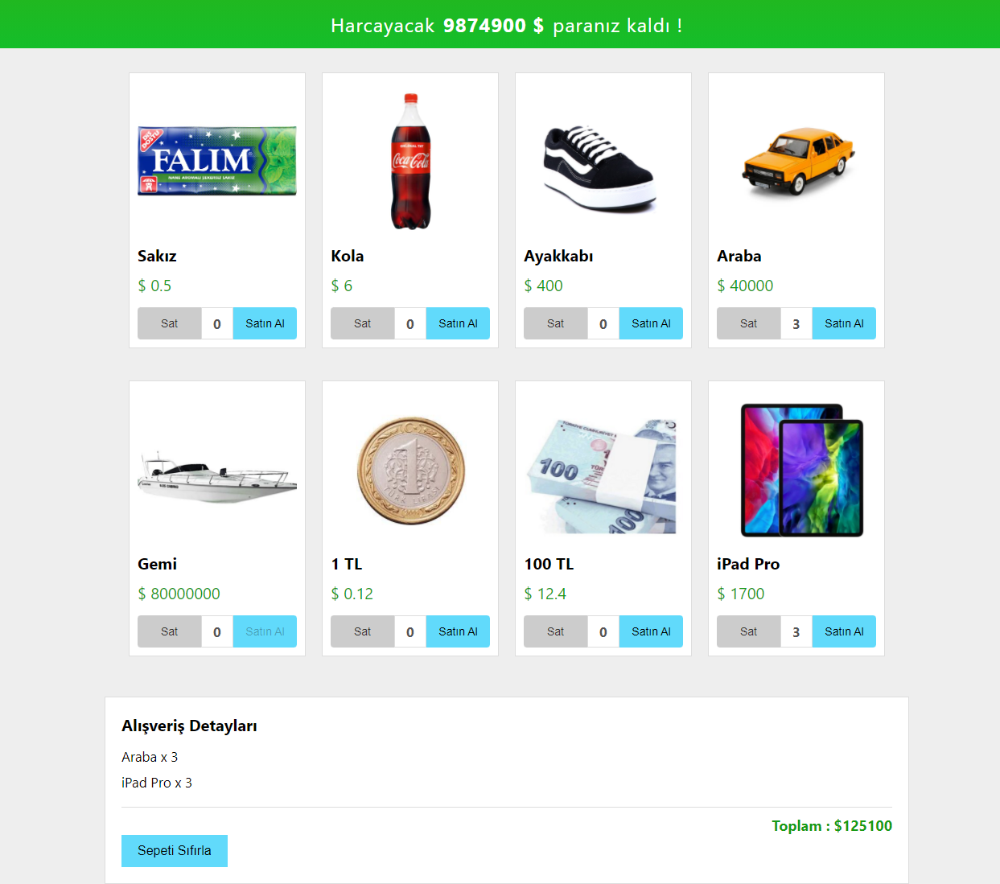

# React Js. İle Para Harcama Uygulaması

- Kullanıcıya ilk etapta belli bir miktar para verilir.
- Verilen para ile ürün listesindeki ürünlerden seçer.
- Seçilen ürünler sepete eklenir.
- Ürünlerin toplam tutarı hesaplanıp verilen paradan eksiltilir.

## Ekran Görüntüsü

## Teşekkür

- Bu uygulama Tayfun Erbilen'in çalışmasından örnek alınarak yapılmıştır.